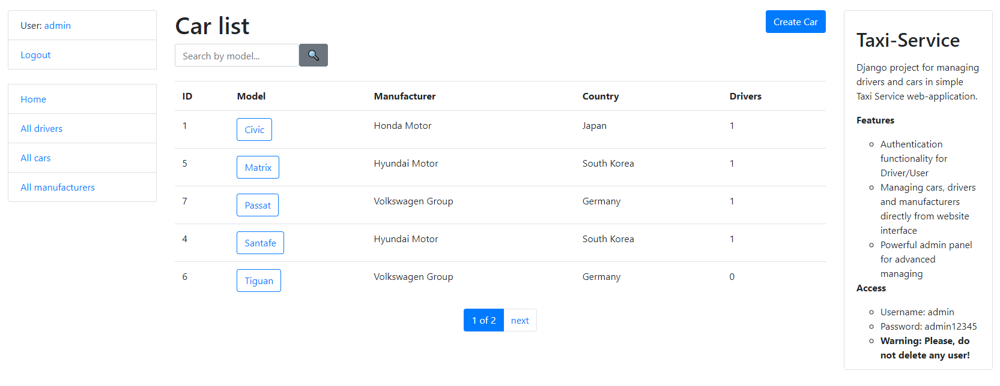

# Taxi-Service

Django project for managing drivers and cars in simple Taxi Service web-application.

## Check it out!

[Taxi-service project deploy to Heroku](https://taxiservice-app.herokuapp.com)

## Installation

Python3 must be already installed

```shell
git clone https://github.com/denyslipin/Taxi-Service
python3 -m venv venv
source venv/bin/activate - on macOS (venv\Scripts\activate - on Windows)
pip install -r requirements.txt
python3 manage.py migrate
python3 manage.py runserver
```

## Features

* Authentication functionality for Driver/User
* Managing cars, drivers and manufacturers directly from website interface
* Powerful admin panel for advanced managing

## Access

* Username: admin
* Password: admin12345
* ##### Warning: Please, do not delete any user!

## Demo


